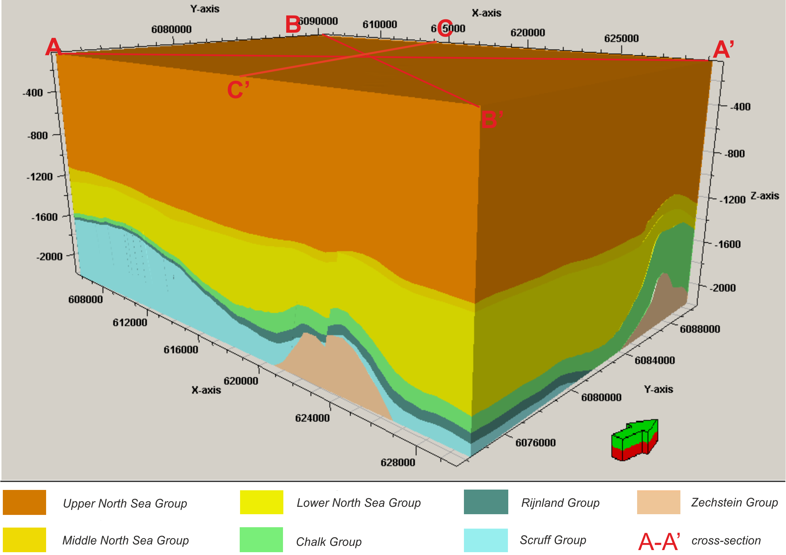

# A Machine Learning Benchmark for Facies Classification

[Yazeed Alaudah](http://www.yalaudah.com), Patrycja Michalowicz, [Motaz Alfarraj](http://www.motaz.me), and [Ghassan AlRegib](http://www.ghassanalregib.com)


[](https://zenodo.org/badge/latestdoi/165411165)


This repository includes the codes for the paper: 

'**A Machine Learning Benchmark for Facies Classification**' that is published in the SEG *Interpretation* journal. [[arXiv]](https://arxiv.org/abs/1901.07659)[[SEG Digital Library]](https://library.seg.org/doi/10.1190/INT-2018-0249.1)

The code in mainly built using the [PyTorch](https://pytorch.org/) deep learning library. 

--------



## Abstract

The recent interest in using deep learning for seismic interpretation tasks, such as facies classification, has been facing a significant obstacle, namely the absence of large publicly available annotated datasets for training and testing models. As a result, researchers have often resorted to annotating their own training and testing data. However, different researchers may annotate different classes, or use different train and test splits. In addition, it is common for papers that apply deep learning for facies classification to not contain quantitative results, and rather rely solely on visual inspection of the results. All of these practices have lead to subjective results and have greatly hindered the ability to compare different machine learning models against each other and understand the advantages and disadvantages of each approach. 

To address these issues, we open-source an accurate 3D geological model of the Netherlands F3 Block. This geological model is based on both well log data and 3D seismic data and is grounded on the careful study of the geology of the region. Furthermore, we propose two baseline models for facies classification based on deconvolution networks and make their codes publicly available. Finally, we propose a scheme for evaluating different models on this dataset, and we share the results of our baseline models. In addition to making the dataset and the code publicly available, this work can help advance research in this area and create an objective benchmark for comparing the results of different machine learning approaches for facies classification for researchers to use in the future.


## Dataset

To download the training and testing data, run the following commands in the terminal: 

```bash
# download the files: 
wget https://www.dropbox.com/s/p6cbgbocxwj04sw/data.zip
# check that the md5 checksum matches: 
openssl dgst -md5 data.zip # Make sure the result looks like this: MD5(data.zip)= bc5932279831a95c0b244fd765376d85, otherwise the downloaded data.zip is corrupted. 
# unzip the data:
unzip data.zip 
# create a directory where the train/val/test splits will be stored:
mkdir data/splits
```

Alternatively, you can click [here](https://www.dropbox.com/s/p6cbgbocxwj04sw/data.zip) to download the data directly. Make sure you have the following folder structure in the `data` directory after you unzip the file: 

```bash
data
├── splits
├── test_once
│   ├── test1_labels.npy
│   ├── test1_seismic.npy
│   ├── test2_labels.npy
│   └── test2_seismic.npy
└── train
    ├── train_labels.npy
    └── train_seismic.npy
```

The train and test data are in NumPy `.npy` format ideally suited for Python. You can open these file in Python as such: 

```python
import numpy as np
train_seismic = np.load('data/train/train_seismic.npy')
```

**Make sure the testing data is only used once after all models are trained. Using the test set multiple times makes it a validation set.**

We also provide fault planes, and the raw horizons that were used to generate the data volumes in addition to the processed data volumes before splitting to training and testing. If you're interested in this data, you can download it from [here](https://www.dropbox.com/s/cvfrud3kp3o69ar/raw.zip). In addition, you can download the well log files from [here](https://www.dropbox.com/s/vupljhjd3pqr8du/logs.zip). 

  

## Getting Started

There are two main models in this repo, a patch-based model and a section-based model. Each has its own train and test files. But before you run the code, make sure you have the following packages installed:

### Prerequisites:

The version numbers are the exact ones I've used, but newer versions should works just fine. 

```
Pillow == 5.2.0
matplotlib == 2.0.2
numpy == 1.15.1
tensorboardX == 1.4 # from here: https://github.com/lanpa/tensorboardX
torch == 0.4.1
torchvision == 0.2.1
tqdm == 4.14.0
scikit-learn == 0.18.1
```

### Training: 

To train the patch-based model with a different batch size and with augmentation,  you can run:

```bash
python patch_train.py --batch_size 32 --aug True
```

Unless you specify the options you want, the default ones (listed in `patch_train.py` will be used). Similarly, you can do the same thing for the section-based model. 

### Testing:

To test a model, you have to specify the path to the trained model. For example, you can run: 

```bash
python patch_test.py --model_path 'path/to/trained_model.pkl' 
```

In order to be consistent with the results of the paper, we suggest you keep all the test options to their deafault values (such as `test_stride` , `crossline` and `inline` ). Feel free to change the test `split` if you do not want to test on both test splits, and make sure you update `train_patch_size` if it was changed during training. Once the test code is finished, it will print the results in the terminal. You can also view the test results, both images and metrics, in Tensorboard.  


## Citation: 

If you have found our code and data useful, we kindly ask you to cite our work. You can cite the arXiv preprint for now: 
```tex
@article{alaudah2019machine,
author = {Yazeed Alaudah and Patrycja Michałowicz and Motaz Alfarraj and Ghassan AlRegib},
title = {A machine-learning benchmark for facies classification},
journal = {Interpretation},
volume = {7},
number = {3},
pages = {SE175-SE187},
year = {2019},
doi = {10.1190/INT-2018-0249.1},
URL = {https://doi.org/10.1190/INT-2018-0249.1},
eprint = {https://doi.org/10.1190/INT-2018-0249.1}
}
```
The arXiv preprint is available at: [https://arxiv.org/abs/1901.07659](https://arxiv.org/abs/1901.07659). The paper is also available in the SEG Digital Library: [https://library.seg.org/doi/10.1190/INT-2018-0249.1](https://library.seg.org/doi/10.1190/INT-2018-0249.1)


## Questions?

The code and data are provided as is with no guarantees. If you have any questions, regarding the dataset or the code, you can contact me at (yalaudah [at] gmail [dot] com), or even better open an issue in this repo and we'll do our best to help.
